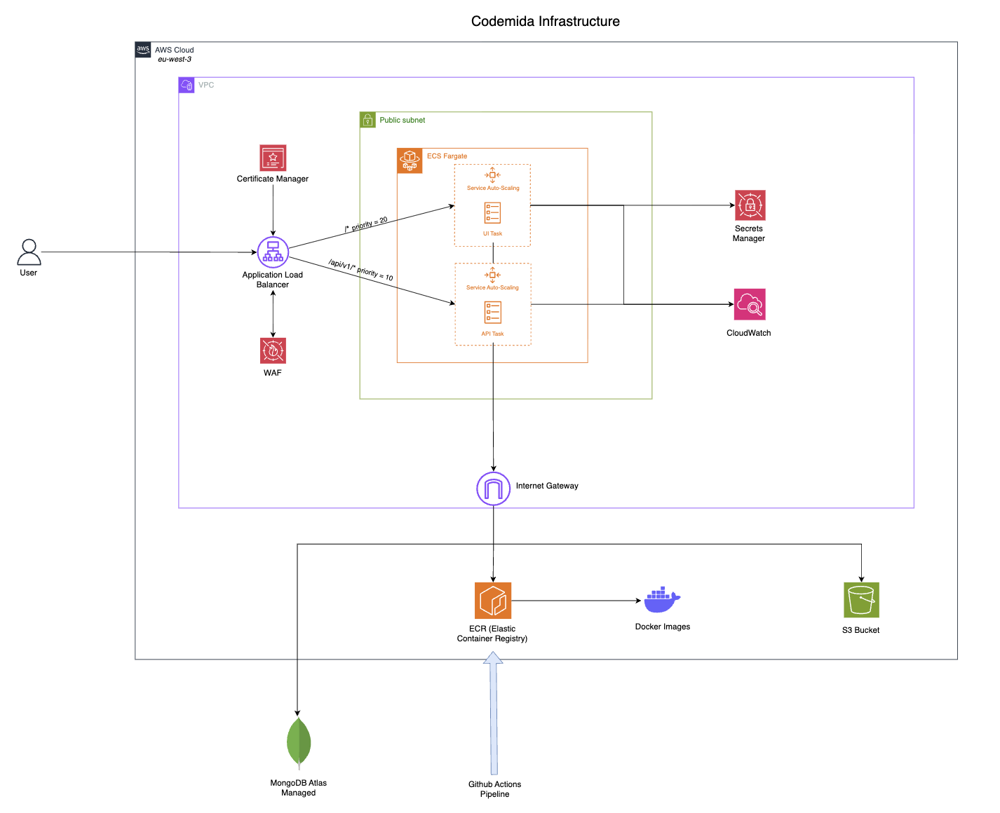

# Codemida SaaS – AWS Terraform Infrastructure

This repository contains the Terraform code and AWS architecture for my SaaS company: **a QR menu generator that automatically translates restaurant menus into 200+ languages**.  
The application was initially deployed across multiple platforms (Vercel and Railway) and has since been fully migrated to **AWS** for improved scalability, reliability, and unified operations.

---

## Project Overview

The platform enables restaurants to:

- Upload and manage digital menus.
- Generate QR codes automatically for each menu.
- Automatically translate content into 200+ languages using translation API.
- Deliver secure, localized menus with low latency.

---

## Infrastructure Overview

The Terraform setup provisions the complete AWS infrastructure for a production-grade SaaS deployment:

- **Amazon ECS (Fargate)** – Runs containerized application services with fine-grained, configurable auto-scaling.
- **Amazon ECR** – Hosts Docker images built and pushed automatically through a GitHub Actions CI/CD pipeline.
- **Application Load Balancer (ALB)** – Routes traffic securely to ECS services with health checks and SSL termination.
- **AWS WAF (Web Application Firewall)** – Protects the application using AWS-managed security rules.
- **Amazon CloudWatch** – Centralized logging and monitoring for ECS tasks and application performance.
- **Amazon S3** – Used for static asset storage (images, QR codes). This bucket existed prior to the AWS migration and was integrated seamlessly into the new infrastructure.
- **Terraform Remote State (S3 Backend)** – Stores Terraform state securely.
- **GitHub Actions CI/CD Pipeline** – Automates the full deployment cycle:

  1. Build Docker images.
  2. Push to Amazon ECR.
  3. Redeploy ECS services automatically.

- **MongoDB Atlas** – Managed database service used for cost and convenience reasons.  
  Although MongoDB Atlas currently hosts the production database, a **future migration to Amazon DocumentDB** is considered to centralize infrastructure and gain finer control over scalability and cost optimization.

**Note:**  
The infrastructure is designed to be **multi-AZ** — Terraform dynamically provisions multiple public subnets across different Availability Zones.

**Design Choice:**  
While ECS tasks could be deployed in private subnets with a NAT Gateway or VPC endpoints for tighter network isolation, this setup currently uses **public subnets with an Internet Gateway** for simplicity and cost efficiency.  
Inbound access to ECS tasks remains protected through **strict security groups** and the **Application Load Balancer**, ensuring that no container is directly exposed to the internet.

---

## Architecture Diagram



_For simplicity, the diagram shows a single public subnet.  
In production, the infrastructure is deployed across multiple Availability Zones (multi-AZ) using Terraform, ensuring high availability and fault tolerance._

---

## Modularity and Scalability

The Terraform configuration is **modular**, allowing:

- Deployment of multiple ECS services (apps) with isolated configurations.
- Per-service tuning of scaling rules and resource allocations.
- Easy duplication of environments (e.g., staging, production).

Auto-scaling for ECS services is fully configurable, allowing the platform to adjust seamlessly to varying traffic loads.

---

## Secrets and Sensitive Data

A **`secrets.tfvars`** file (excluded from the repository) must be created locally to define the sensitive variables required for provisioning **AWS Secrets Manager** entries.  
This file typically contains application secrets, database URIs, and API keys that need to be stored securely.

All secrets are **created and managed via AWS Secrets Manager**, not hardcoded or referenced directly in Terraform resource definitions.  
Instead of injecting plain values into ECS task definitions or Terraform code, Terraform only references the **ARNs or names of the secrets**, ensuring:

- Secret values are never written in plain text within the Terraform codebase.
- Sensitive data does **not appear in the Terraform state file**, preventing potential leaks.
- Secrets can be rotated or updated in AWS Secrets Manager without redeploying infrastructure.

This approach provides a clean separation between **infrastructure as code** and **secret management**, aligning with AWS security best practices.

---

## HTTPS and TLS Certificates

For the **staging** environment, a **self-signed TLS certificate** is created to enable HTTPS without requiring a real domain certificate.  
To use a valid domain certificate in production:

1. Obtain a certificate through **AWS Certificate Manager (ACM)**.
2. Modify the `aws_lb_listener_certificate` resource inside `modules/infra/certificate.tf` to reference your certificate’s ARN.

This simple change enables HTTPS using your custom domain in production.

---

## Why AWS?

The migration from a multi-cloud setup (Vercel + Railway + MongoDB Atlas) to AWS offers several advantages:

### 1. **Unified Infrastructure**

Consolidating compute, storage, and networking on AWS simplifies management, monitoring, and scaling.  
While the database remains on Atlas for now, all other components are fully integrated under AWS.

### 2. **CI/CD and Automation**

GitHub Actions automates the full deployment lifecycle — from image build to ECS redeployment — providing a smooth developer experience and consistent releases.

### 3. **Security and Control**

IAM roles, WAF, and Secrets Manager ensure a secure, principle-of-least-privilege setup.  
Future enhancements such as **VPC endpoints** for private ECR access are possible but currently deferred for cost efficiency.

### 4. **Cost and Performance Balance**

Decisions were made to optimize performance while keeping infrastructure costs aligned with the SaaS’s current revenue stage.

---

## Tech Stack

| Layer              | Technology          | Purpose                                |
| ------------------ | ------------------- | -------------------------------------- |
| IaC                | Terraform (modular) | Infrastructure provisioning            |
| Compute            | ECS (Fargate)       | Application hosting                    |
| Container Registry | ECR                 | Docker image storage                   |
| Load Balancing     | ALB                 | Traffic routing & SSL termination      |
| Security           | AWS WAF, IAM        | Threat mitigation & access control     |
| Database           | MongoDB Atlas       | Managed document database              |
| Storage            | S3                  | Static assets & Terraform remote state |
| CI/CD              | GitHub Actions      | Build, push, and deploy automation     |
| Monitoring         | CloudWatch          | Logs and metrics                       |

---

## Deployment

To provision the infrastructure:

```bash
terraform init
terraform plan -var-file="secrets.tfvars"
terraform apply -var-file="secrets.tfvars"
```

Ensure that:

- **AWS credentials** are configured properly.
- The **S3 backend** for Terraform state is accessible.
- The **`secrets.tfvars`** file is defined locally (and excluded from version control).

The **CI/CD pipeline** will then build and deploy automatically to ECS on code pushes.

---

## 📫 Contact

If you’re interested in **AWS architecture**, **Terraform automation**, or **SaaS scalability**, feel free to reach out or start a discussion.

**Author:** antoinep23
**LinkedIn:** [https://www.linkedin.com/in/antoine-papyn-2b6614207/]
**GitHub:** [https://github.com/antoinep23]  
**Codemida:** [https://codemida.com]

---

_This repository is part of my cloud engineering portfolio, showcasing my real-world AWS infrastructure, Terraform automation, and DevOps practices for a production SaaS migration._
